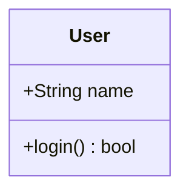

# viewer.toml フォーマット仕様

ドキュメントビューワーのプロジェクト設定ファイルです。
TOML 形式で記述し、ビューワーから「開く」で読み込みます。

---

## 全体構造

```toml
[roots]
spec   = "C:/path/to/specs"    # 仕様書フォルダの絶対パス
design = "C:/path/to/designs"  # 設計書フォルダの絶対パス
source = "C:/path/to/sources"  # ソースコードフォルダの絶対パス

[[nodes]]
# ドキュメント構成ツリーのノード（複数記述可）
```

---

## [roots] セクション

| キー | 型 | 説明 |
|------|----|------|
| `spec` | string | 仕様書ファイル群のルートフォルダ（絶対パス） |
| `design` | string | 設計書ファイル群のルートフォルダ（絶対パス） |
| `source` | string | ソースコードのルートフォルダ（絶対パス） |

パス区切りは `\\`（Windows バックスラッシュ）または `/`（スラッシュ）どちらでも可。

---

## [[nodes]] セクション

ビューワー左側のツリーに表示される1項目。`[[nodes]]` を繰り返して複数定義します。

| キー | 型 | 必須 | 説明 |
|------|----|------|------|
| `id` | string | ✔ | ノードの一意ID（任意の文字列） |
| `label` | string | ✔ | ツリーに表示する名前 |
| `parent` | string | ✔ | 親ノードの `id`。ルートノードは `""` |
| `links` | array | - | 仕様書↔設計書の紐づけ（タブとして表示） |
| `sources` | array of string | - | 関連ソースファイルのパス（roots.source からの相対パス） |

### `links` の各エントリ

| キー | 型 | 必須 | 説明 |
|------|----|------|------|
| `id` | string | ✔ | 紐づけの一意ID |
| `label` | string | ✔ | タブに表示する名前 |
| `spec` | string | - | 仕様書ファイルのパス（roots.spec からの相対パス） |
| `specHeading` | string | - | 仕様書内でスクロール先の見出し（例: `"## 機能要件"`） |
| `design` | string | - | 設計書ファイルのパス（roots.design からの相対パス） |
| `designHeading` | string | - | 設計書内でスクロール先の見出し |

---

## 記述例

```toml
[roots]
spec   = "C:/project/docs/specs"
design = "C:/project/docs/designs"
source = "C:/project/src"

# ── ルートノード（親なし） ──────────────────────────────────────
[[nodes]]
id     = "root"
label  = "システム概要"
parent = ""

  [[nodes.links]]
  id     = "root-link-1"
  label  = "概要"
  spec   = "overview.md"
  design = "architecture.md"

# ── 子ノード ────────────────────────────────────────────────────
[[nodes]]
id     = "user-mgmt"
label  = "ユーザー管理"
parent = "root"
sources = [
  "UserService.cs",
  "Repositories/UserRepository.cs",
]

  # タブ1: ログイン機能
  [[nodes.links]]
  id            = "user-login"
  label         = "ログイン"
  spec          = "user/login_spec.md"
  specHeading   = "## ログイン仕様"
  design        = "user/login_design.md"
  designHeading = "## シーケンス図"

  # タブ2: ユーザー登録機能
  [[nodes.links]]
  id     = "user-register"
  label  = "ユーザー登録"
  spec   = "user/register_spec.md"
  design = "user/register_design.md"

# ── 孫ノード ────────────────────────────────────────────────────
[[nodes]]
id     = "user-profile"
label  = "プロフィール編集"
parent = "user-mgmt"

  [[nodes.links]]
  id     = "profile-link"
  label  = "メイン"
  spec   = "user/profile_spec.md"
  design = "user/profile_design.md"
```

---

## ツリー表示のイメージ

```
▾ システム概要
  ▾ ユーザー管理
      プロフィール編集
```

`parent` に指定した `id` のノードの子として表示されます。
`parent = ""` のノードがルートに並びます。

---

## 設計書・仕様書で使える Mermaid 記法

ファイル内に以下を書くと図が描画されます。

### インライン（直接記述）

````markdown

````

### 外部ファイル参照（.mmd ファイル）

クラス図エディターで作成した `.mmd` ファイルを参照できます。
ファイルは仕様書・設計書と**同じディレクトリ**に置きます。

````markdown
```mermaid-include
./ClassDiagram.mmd
```
````

---

## パスの注意点

- `roots` の各パスは**絶対パス**です（環境によって変わります）
- `links` の `spec` / `design` および `sources` の各パスは、対応する `roots` からの**相対パス**です
- パス区切りは `/` を推奨（Windows でも動作します）
- ファイルが存在しない場合はビューワーにエラー表示されます（他の項目には影響しません）
